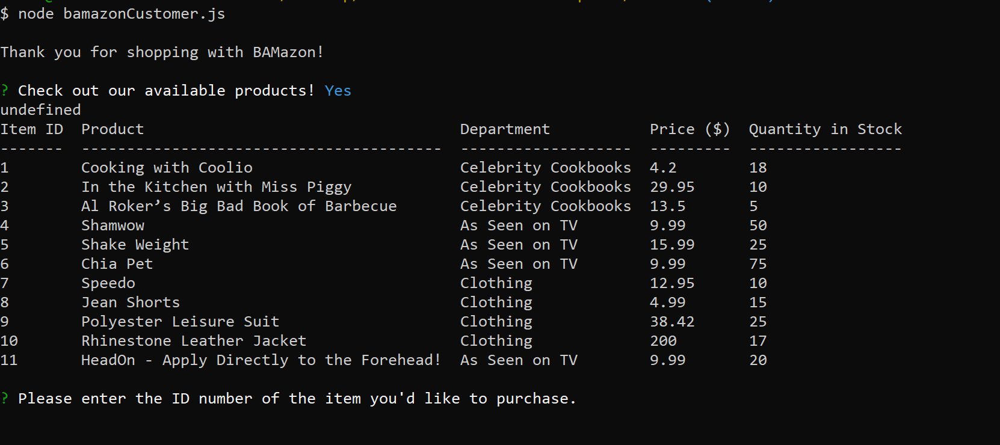

Bamazon is a command line Node application using MySQL and npm packages to create an Amazon-like storefront.

<<<<<<< HEAD
Customer View
The customer view of the app takes in orders from users and depletes stock from the store's inventory. It validates input and will let the customer know if they've entered an invalid item ID or if an item is out of stock. If the item is available in the quantity specified, the customer will be given the total price and the inventory will be updated on the backend.

Manager Portal
=======

<h3>Customer View</h3>

The customer view of the app takes in orders from users and depletes stock from the store's inventory. It validates input and will let the customer know if they've entered an invalid item ID or if an item is out of stock. If the item is available in the quantity specified, the customer will be given the total price and the inventory will be updated on the backend.

<h3>Manager Portal</h3>

>>>>>>> 46eef1c9eeda9c431446e94b8cbdb6a17fd701df
The manager view of the app presents the user with a list of set menu options. Depending on the command selected, the app will read and return data to the manager, or prompt the manager for input to update or insert new data into the database. Managers are able to perform the following functions:

- View Products for Sale
- View Low Inventory
- Add to Inventory
- Add New Product
